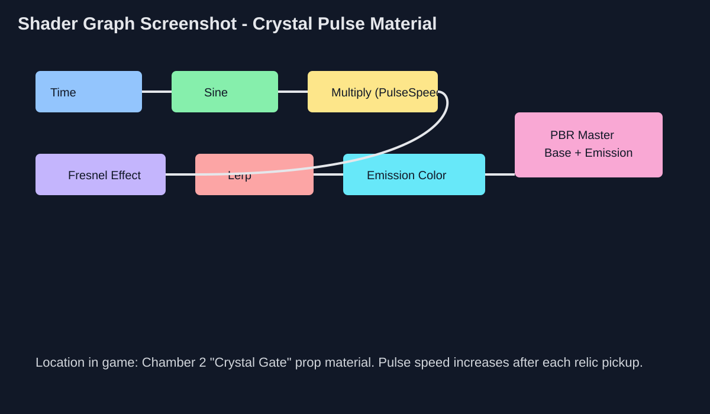

# GDIM33 Vertical Slice

## Milestone 1 Playable Build
This repository now includes a playable Milestone 1 web prototype with the required core scope:
- Player can move left/right and jump.
- Test levels have platforming obstacles (gaps + spikes).
- Player can reach progression gates across six levels, then complete the final gauntlet.
- Enemy uses a behavior state machine with **Patrol → Alert → Reset**.
- Includes interactive **joystick/lever pulls** to unlock progression gates.
- Player and enemy use more polished, distinct visual materials/styles.
- Player and enemy models now include layered parts and richer animation states for idle, run, jump/fall, dash, patrol, alert, reset, and defeated reads.
- Moved the Visual Scripting bridge explanation outside the gameplay canvas so the game screen only shows tutorial prompts.
- Added audio effects, particle VFX, ambient VFX, and decorative tilemap layers for stronger polish.
- Added extra mechanics for richer play: moving platforms, bounce pads, crumble platforms, dash-refresh orbs, respawning enemies, and collectible relic objectives.
- Stage 1 difficulty is tuned easier (lighter enemy pressure and safer hazard spacing) to improve onboarding.

Goal: collect relics in each stage, use movement tools like bounce pads and dash-refresh orbs, then pull that stage’s joystick to unlock its gate and progress. Enemies now respawn after being stomped, so they function as repeatable threats and timing challenges rather than temporary gate keys.

## State Machine (MS1) — detailed implementation
The enemy state machine is the main Milestone 1 state machine and it is still active in every level. It is implemented in `game.js` with explicit `EnemyStates`, transition evaluation in `getEnemyTransition()`, state-entry side effects in `enterEnemyState()`, and per-state actions in `updateEnemyPatrol()`, `updateEnemyAlert()`, and `updateEnemyReset()`.

Enemy behavior uses three states:
- **Patrol**: the enemy moves horizontally between `patrolMinX` and `patrolMaxX`. Hitting either bound flips `direction`, so the enemy loops in a fixed guard zone.
- **Alert**: the enemy has detected the player. It chases toward the player's current X position at `1.35×` its patrol speed, stays clamped inside its patrol arena, plays the alert audio cue, and emits red alert particles when entering the state.
- **Reset**: the player escaped. The enemy stops chasing and walks back toward `patrolMinX`. When it reaches the patrol origin, it re-enters Patrol and faces right again.

Transitions:
- **Patrol → Alert**: `abs(playerCenterX - enemyCenterX) < detectionRange`.
- **Alert → Reset**: `abs(playerCenterX - enemyCenterX) > resetRange`. The reset range is intentionally larger than the detection range so the enemy does not flicker states at the edge.
- **Reset → Patrol**: `abs(enemy.x - patrolMinX) < 4`.

Gameplay outcomes connected to the state machine:
- Touching an active enemy from the side/front removes one heart and briefly makes the player invulnerable; running out of hearts restarts the level.
- Falling onto an enemy from above defeats it and bounces the player upward.
- Defeated enemies temporarily leave the arena and later respawn, which makes the state machine part of the complicating gameplay factor without letting respawns re-lock progression gates.

State machine diagram: [`docs/enemy-state-machine.svg`](docs/enemy-state-machine.svg).

## Milestone Feature 3: chosen Unity system
The chosen Unity system is **Unity Visual Scripting**. Because this repository is a web prototype rather than a Unity project, the Unity-system integration is demonstrated as a devlog-only architecture bridge instead of extra UI inside `index.html` or the gameplay canvas.

How the bridge maps to the intended Unity implementation:
- `PlayerController.cs` would own movement, jump buffering, coyote time, ground dash, dash-refresh orb pickup, stomp detection, and player reset/win state.
- `EnemyStateMachine.cs` would mirror the `EnemyStates` implementation in `game.js`: Patrol, Alert, and Reset, with the same detection/reset thresholds and transition rules.
- `RelicGateGraphBridge.cs` would be the C# bridge that raises Visual Scripting custom events such as `RelicCollected`, `DashOrbCollected`, `EnemyDefeated`, `JoystickPulled`, and `GateUnlocked`.
- The Visual Scripting Graph would receive those custom events and route feedback to audio, particle VFX, gate animation, and status feedback.

Graph documentation remains in the devlog assets, not on the playable page:
- Visual Scripting event bridge: [`docs/visual-scripting-graph.svg`](docs/visual-scripting-graph.svg)
- Enemy state machine graph: [`docs/enemy-state-machine.svg`](docs/enemy-state-machine.svg)

## Milestone Feature 4: complicating gameplay factor
The complicating gameplay factor is the **relic-gated traversal loop** layered on top of platforming and the enemy state machine. The player must still move, jump, avoid spikes, use the joystick lever, and survive enemies, but later levels vary the traversal pressure:
- **Standard relic gates**: each level requires all relics before the joystick opens the gate.
- **Dash-refresh traversal**: dash orbs refresh dash in mid-route, letting the player choose more aggressive platforming lines without changing the base collision rules.
- **Respawning enemy pressure**: enemies can be stomped for breathing room, then return on a countdown so they stay relevant without blocking gate unlocks.
- **Route variety**: moving platforms, bounce pads, crumble platforms, spike fields, and final-level return pads ask the player to reuse the same mechanics in new layouts.

This preserves the original Milestone 1 mechanics while making the loop more variable: each chamber asks the player to decide whether to prioritize relic routing, combat/stomping, or movement execution.

## Milestone 1 Devlog

### Prompt 1: Pick 1 Visual Scripting Graph and explain how it works
The Visual Scripting graph I modeled in this prototype is the **Enemy Behavior State Machine** (implemented in code as the same graph logic). The graph continuously measures the horizontal distance between the player and the enemy, then routes behavior through three states: **Patrol**, **Alert**, and **Reset**. In Patrol, the enemy paces between two X-boundaries. When the player enters a detection threshold, the transition condition fires and the graph switches to Alert, where movement changes to a faster chase-style motion toward the player. If the player leaves a larger reset threshold, the graph transitions to Reset, where the enemy returns to its patrol origin and then re-enters Patrol. This graph improves gameplay because the enemy is no longer static; it reacts to player position and changes behavior based on state.

### Prompt 2: Updated break-down + state machine explanation
I updated my game break-down by separating “Enemy” into a full **state-machine system** rather than treating it as one simple object. The break-down now explicitly lists enemy states, state transitions, detection values, and reset behavior. This update makes the design more implementation-ready: each state now has a clear purpose, condition checks, and gameplay impact. I also clarified keyboard input and player movement as the core mechanic layer for MS1 (move, jump, reset), which directly matches the milestone rubric for playable mechanics and responsive controls.

The state machine is connected to other systems in the game. It depends on the **Player System** for position/distance checks, feeds into the **Challenge/Level System** by controlling threat pressure in the obstacle section, and integrates with the **Fail/Reset System** via collision outcomes and restart flow. In other words, the enemy state machine is not isolated; it is a behavior controller that links input-driven player movement, level pacing, and fail/retry feedback into one playable loop.

### Updated Break-down (attached for Devlog)
**Player System**
- Input: `A/D` or arrows to move, `Space` to jump, `E` to interact, `R` to reset.
- Physics: gravity, ground/platform collision, jump arc.
- State flags: alive/won.

**Level System**
- Level 1 start area + first gate transition.
- Level 2 platform sequence with spikes and enemy encounter.
- Lever/joystick interaction area to unlock gate.
- Final gate goal area.

**Enemy System (State Machine)**
- States: Patrol, Alert, Reset.
- Transition checks: player distance in/out of thresholds.
- Patrol bounds and return-to-origin logic.
- Contact outcome: player reset on collision.

**Game Loop / Feedback System**
- Per-frame update/draw loop.
- Status text for fail, success, and replay instructions.
- Win state + manual replay/reset flow.

## Milestone 2 Devlog

### ANSWER THIS BEFORE CODING: Complicating gameplay summary and task break-down
For this milestone, I built on the existing relic-gated joystick mechanic and polished it into a clearer **relic-routing loop with graph-driven feedback documented in the devlog**. The complicating gameplay factor is that the player cannot simply run to the exit: they must collect relics, survive dynamic platforming obstacles, use dash-refresh orbs and bounce pads, manage respawning enemies, return to the joystick lever, and trigger the gate unlock while enemy state-machine pressure continues to matter.

1. **Make the relic-gated joystick loop easier to read and preserve the existing gameplay.**
   - Keep the Milestone 1 movement, jumping, reset flow, and enemy Patrol → Alert → Reset state machine working.
   - Keep joystick gates connected to relic collection so enemy respawns cannot make the unlock requirement inconsistent.
   - Add clearer status feedback when the player collects relics, lacks relics, or unlocks the gate.
   - Verify that hazards, enemy collisions, stomp defeat, level transitions, and final win state still behave correctly.

2. **Increase character model complexity without changing collision balance.**
   - Replace simple rectangular player art with layered helmet, visor, torso armor, scarf, arms, legs, boots, backpack, shadows, and dash trail details.
   - Replace simple blob enemy art with animated legs, feet, antennae/horns, armor ring, eyes, jaw, teeth, and state-colored materials.
   - Keep the collision boxes the same so improved visuals do not break existing platforming.
   - Use enemy state color and animation speed to communicate Patrol, Alert, Reset, and defeated conditions.

3. **Integrate the chosen visual-scripting-style system and additional polish outside the core game UI.**
   - Keep graph labels and explanation outside the gameplay canvas so the player only sees tutorial prompts while playing.
   - Trigger code-side feedback from relic collection, dash, dash-refresh orbs, bounce pads, enemy alerts, hazards, and joystick unlock events.
   - Add audio effects, particle VFX, ambient VFX, and tilemap-like decorative layers without changing collision balance.
   - Document the intended Unity bridge as custom events moving between gameplay scripts and a Visual Scripting Graph, and include the graph screenshot asset for submission.

### ANSWER THIS AFTER CODING: Reflection
The W5 task steps break-down helped because it forced me to separate the feature into testable chunks instead of treating “polish” as one vague task. The biggest benefit was preserving the already-working Milestone 1 requirements first, then layering visual and feedback complexity on top of the same collision boxes. If I did it again, I would improve the break-down by adding more explicit acceptance checks, such as “gate stays locked at 1/2 relics,” “enemy still changes to Alert near the player,” and “dash does not recharge in air.” That would make each task easier to verify after implementation.

### Visual scripting and code bridge
The playable web build bridges code and a graph-style system through code-side gameplay events plus documentation outside the gameplay canvas. The code-side gameplay methods update relic collection, dash, dash-refresh orbs, bounce pads, hazards, enemy alerts, enemy defeat, joystick unlock state, and gate transitions. Those events trigger audio cues and particle VFX in `game.js`, while the Visual Scripting Graph itself is documented only in the devlog assets: [`docs/visual-scripting-graph.svg`](docs/visual-scripting-graph.svg) and [`docs/enemy-state-machine.svg`](docs/enemy-state-machine.svg).

For the Unity version, the equivalent C# scripts would be:
- `PlayerController.cs`: owns movement, jump buffering, coyote time, ground dash, dash-refresh orb pickup, stomp detection, and player reset/win state.
- `EnemyStateMachine.cs`: owns Patrol, Alert, and Reset, using the same transition conditions described in the State Machine section.
- `RelicGateGraphBridge.cs`: listens for relic collection, dash orb collection, enemy defeat, and joystick interactions, then raises custom Visual Scripting events such as `RelicCollected`, `DashOrbCollected`, `EnemyDefeated`, and `GateUnlocked`.
- `GateController.cs`: receives the unlock result and changes the gate from locked to open.

This architecture keeps rules and collision in code while allowing the Visual Scripting Graph to own readable feedback/FX routing.

### Unity system integration note
The chosen Unity system for the intended Unity build is **Unity Visual Scripting**. In this repository's HTML5 prototype, that system is represented by devlog-only graph documentation plus gameplay events that route to audio/VFX feedback, so the architecture can be demonstrated without adding extra non-tutorial text to the game screen or the index page. The implemented flow mirrors a Visual Scripting Graph receiving custom gameplay events from code and routing feedback to UI/FX.

## Milestone 3 Devlog

**1) ShaderGraph explanation + screenshot**
I used a **Crystal Pulse** Shader Graph on the Chamber 2 crystal gate prop (the gate that blocks progress until relic objectives are complete). In the graph, `Time` drives a `Sine` waveform, and that value is scaled by a `PulseSpeed` float property (`Multiply`) to animate emission intensity over time. I then combine that pulse with a `Fresnel Effect` rim term and blend colors with `Lerp` so the crystal edges brighten at grazing view angles while the core stays darker. Finally, the result is routed to Lit/PBR output (`Base Color` + `Emission`), which makes the object read as energized and reactive instead of static. This is the shader the graders should check for credit: the glowing crystal gate in Chamber 2.
**Screenshot:** 

**2) Gameplay improvements from playtesting (paragraph)**
From playtesting, the biggest issue was clarity around why players were blocked and when to push forward versus retreat. I improved gate-state communication (clear locked/unlocked signals), strengthened enemy-alert readability, and tuned dash refresh timing to reduce frustration while keeping movement skill-based. I also tightened reset/checkpoint flow so failed attempts return players to action faster, which improved pacing.

**3) New content added + gameplay-loop context (paragraph)**
Since the previous milestone, I expanded content so the core loop is repeatable instead of one-and-done: more relic objectives, more enemy encounters, additional traversal hazards, and a multi-step gate progression structure. Players now perform the same foundational mechanics (platforming, dash management, threat handling, and objective collection) across multiple rooms/tasks before completion, which closes the main vertical-slice gameplay loop.

## Milestone 4 Devlog
Milestone 4 Devlog goes here.

## Final Devlog

**1) Vertical Slice core loop + content**
The core gameplay loop is: enter a chamber, read the terrain/enemy pattern, collect every relic, return to the joystick lever, activate the gate, and move to the next level. Across the six-level build, the player uses the same basic movement verbs (run, jump, ground dash, stomp enemies, and reset when needed) against increasingly varied content: static platforms, spikes, moving platforms, bounce pads, crumble platforms, dash-refresh orbs, relic routes, respawning patrol enemies, hearts/invulnerability, HUD feedback, SFX/BGM, and final gate progression. This matches my original Vertical Slice plan because it shows the player what the full game would feel like in miniature: short platforming rooms built around readable objectives, layered traversal tools, repeatable enemy pressure, and gates that turn exploration into a complete objective loop instead of a single mechanic test.

**2) Gameplay-activated rendering effect**
The rendering effect is the **Crystal Gate Pulse material/effect** in `game.js`. Gameplay logic activates it through `triggerGateRenderEffect(level, intensity, duration)`: collecting a relic calls that function with a smaller intensity burst, while successfully pulling a joystick to unlock the gate calls it with a stronger burst. The gate stores `effectTimer`, `effectDuration`, and `effectIntensity`; `updateDynamicFeatures()` counts the timer down each frame, and `drawGate()` uses those values to change rendering state with a timed glow. Technically, the draw path uses a gate-local material state, `CanvasRenderingContext2D.shadowBlur`, `shadowColor`, `globalCompositeOperation = 'screen'`, and a radial gradient overlay to simulate an emissive shader pulse. The effect is not just particles: the gate renderer itself changes its material/glow based on gameplay state. Relevant code: `triggerGateRenderEffect()`, the relic/lever calls in `updatePlayer()`, and the material-style glow logic in `drawGate()` in `game.js`.

**3) Break-down process**
My process for breaking down a large project is to start with a bubble diagram of major systems, then convert each bubble into task-step checklists with acceptance tests. For this project, the main bubbles were Player Controller, Level/Gate Objectives, Enemy State Machine, Hazards/Traversal Tools, Audio/VFX/Rendering Feedback, HUD/Health, and Devlog/Submission. I do plan to keep using both bubble diagrams and task step break-downs: the bubble diagram helps me see how systems depend on each other, while the task list keeps implementation concrete enough to test. Breaking the project into small steps makes scope much clearer because it turns a vague goal like “polish the game” into checkable pieces such as “enemy respawns after stomp,” “gate unlock does not depend on respawning enemies,” “final level has a return path,” and “collecting relics activates the gate rendering pulse.” In this Vertical Slice, that process worked best when I preserved a playable loop first and then layered complexity on top. The parts that went poorly were places where I added mechanics (enemy respawn) without immediately re-checking dependent systems (enemy-based gate requirements), so in future projects I would add dependency checks to every task: when one system changes, I would explicitly test all systems that read its state.

## Open-source assets
- None yet.
